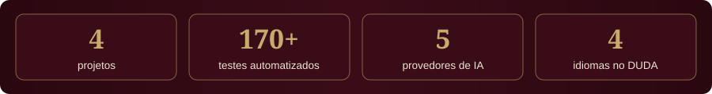
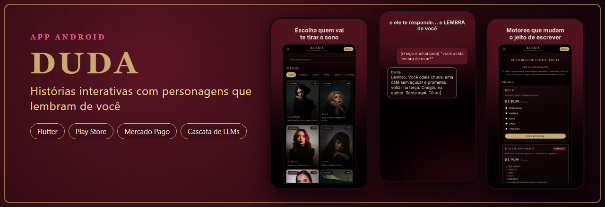
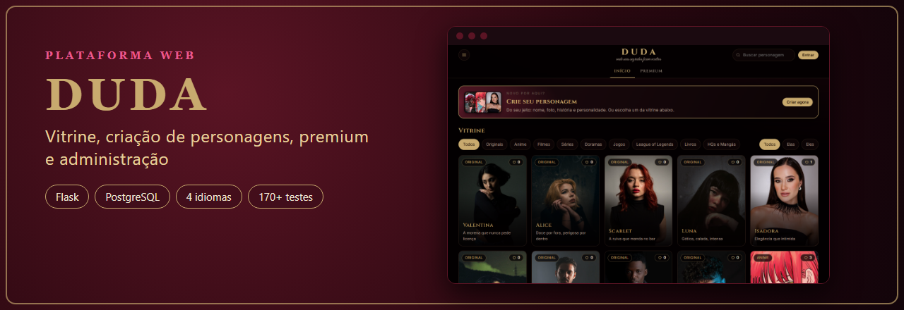
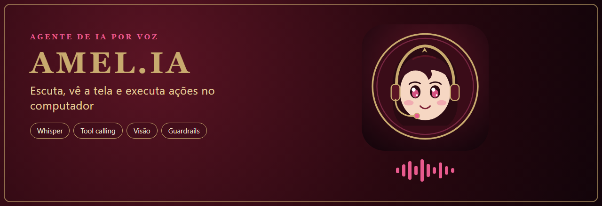
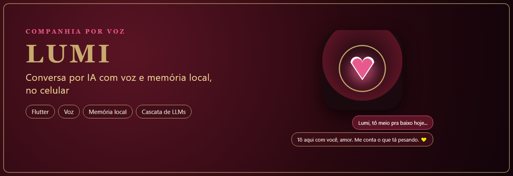

  
  

  Qualidade de software em produtos financeiros e em aplicações baseadas em LLMs: 
  testes funcionais, de comportamento de IA e de experiência do usuário.

  

## Competências

### Qualidade funcional e de produto

| Área | Atuação |
|---|---|
| **Regras de negócio** | Testes funcionais em plataformas financeiras (ciclo requisição → proposta → simulação → aceite → operação), cenários positivos e negativos |
| **Integridade de cálculo financeiro** | Conferência de que parcela, juros e encargos se mantêm consistentes entre etapas e integrações |
| **Validação de notificações** | Conferência do disparo e do conteúdo de e-mails e notificações a partir das ações no sistema: momento, valores, datas e textos |
| **Teste exploratório orientado a risco** | Formulação e verificação de hipóteses de falha, além do roteiro planejado |
| **Verificação de identidade e cadastro** | Testes em fluxos de KYC / validação facial e cadastros de pessoa física e jurídica: obrigatoriedade, formato, limites e persistência |
| **Evidências e severidade** | Documentação de casos e evidências, com classificação de defeitos por severidade |
| **QA de frontend** | Depuração com DevTools (Console/Network): erros de JavaScript e requisições falhas |
| **Usabilidade (UX heurística)** | Avaliação sob a ótica do usuário iniciante, identificando pontos de atrito |

### Qualidade de IA

| Área | Atuação |
|---|---|
| **Avaliação de LLMs** | Alucinação, aderência às instruções, recusas indevidas e consistência de personagem |
| **Guardrails de IA** | Regras e validações que impedem o modelo de afirmar ações não executadas ou ultrapassar limites de conteúdo |
| **Automação de testes** | Suítes de regressão com pytest, com um caso automatizado para cada defeito corrigido |
| **Especificação** | Requisitos de comportamento com exemplos reais de entrada e saída |

## Projetos em destaque

**DUDA · app Android** — app de histórias interativas com personagens que mantêm memória da conversa.

Concebi, testei e levei até a Play Store, do zero ao celular das pessoas. Projetei a cascata de LLMs com fallback por provedor, o controle de concorrência com fila e aviso de lotação, os pagamentos via Mercado Pago e a atualização obrigatória dentro do app. Homologo cada versão antes de publicar.

 

**DUDA · plataforma web** — vitrine de personagens, criação de personagens, área premium e painel administrativo.

Defini os requisitos e garanti a qualidade com 170+ testes automatizados no servidor, testes funcionais e de controle de acesso entre perfis de usuário, em quatro idiomas. Modelei o painel de administração com moderação, códigos premium e comunicados.

 

**Amel.IA · agente de IA por voz** — escuta, identifica quem está falando, lê a tela e executa ações no computador.

Especifiquei todo o comportamento, avaliei as respostas e desenhei os guardrails. Projetei o roteamento entre provedores gratuitos de LLM, a validação que descarta ações alucinadas, a detecção de fim de turno e as integrações com Spotify, navegador e dados ao vivo de partidas de League of Legends.

 

**Lumi · companhia conversacional por voz** — app Android de conversa por IA, com voz e memória local, para apoio, companhia e diálogo.

Concebi o produto e desenhei os contextos de conversa e o design responsável. Implementei a entrada e saída por voz, a memória local persistente por contexto, a cascata de provedores de LLM e a rede de segurança (aviso e canais de ajuda) no contexto de apoio emocional.

## Testes e qualidade

## Tecnologias dos projetos

            

  
  

Fora do trabalho: League of Legends e Elden Ring

